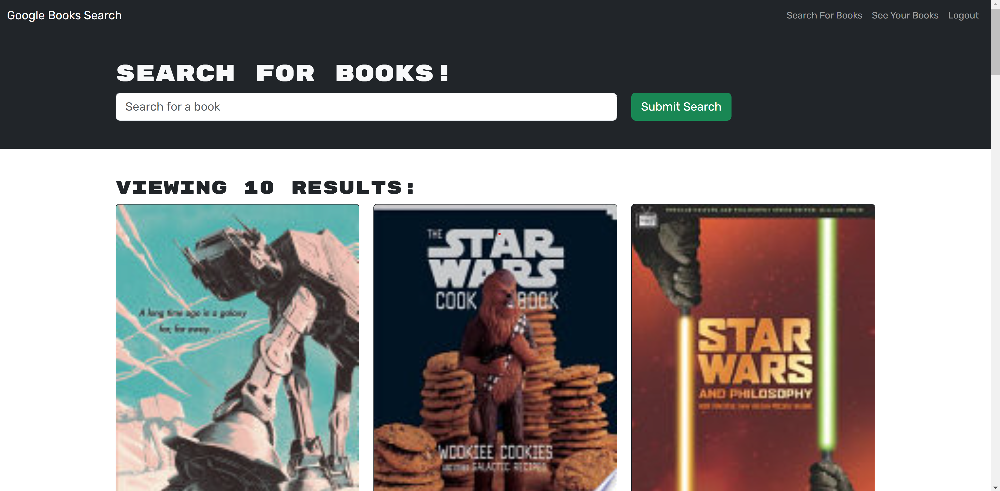

# MERN Book Search Engine

## Description

Users can create accounts and browse the Google Books library to save any books they like or plan to read later. Users can view their saved books by clicking the "See Your Books" tab and can delete any book from their list. This application was modified to be used with ApolloClient and was built using graphql, resolvers, typeDefs, etc. This application is important to create because it demonstrates how applications can be made using all sorts of different programs.

## Screenshot of Deployed Application

## Link to Application

https://mern-book-search-engine482-90e64d5026c6.herokuapp.com/
